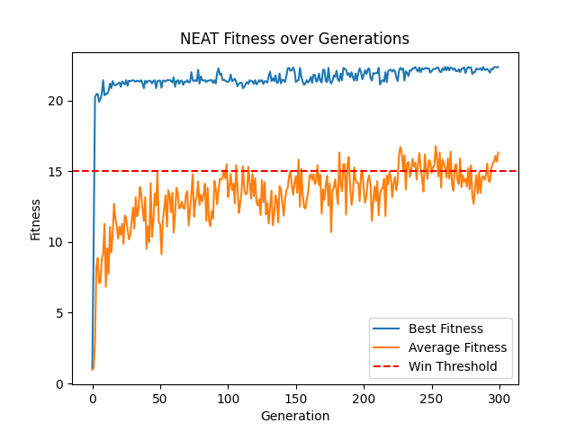

# AI Learns to Play Frogger

Hello!

This project is a simple implementation of a frogger-like game, with two AI agents that learn to play it using Deep Q-learning and NEAT.
It was developed by Liel Amar, Tomer Meidan and Omer Ferster from The Hebrew University of Jerusalem, as part of the course "Introduction to Artificial Intelligence" (2024).

## Installation
To install the required packages, use your favorite package manager to initialize a new environment.
Then, run the following command to install the required packages:
```bash
pip install -r requirements.txt
```

## Configuration
There are several configuration flags that can be inputted to the program, to change the behavior of the game and the learning algorithms.
The flags are as follows:
- `--agent`: The agent to use. Can be either `dqn`, `neat`, `random`, `onlyup` or `human`. Default is `random`.
- `--fps`: The frames per second of the game. Default is 5.
- `--grid_like`: Whether to use a grid-like environment or a continuous one. Default is `False`.
- `--train`: Whether to include the train obstacle or not. Default is `False`.
	@@ -25,7 +25,7 @@ The flags are as follows:
- `--neat_config`: The configuration file for NEAT. Default is `neat-config.txt`.
- `--generations`: The number of generations to run NEAT for. Default is 200.
- `--plot`: Whether to plot the results or not. Default is `False`.
- `--test`: Whether to test a model or not. Default is None. `*` tests all available models will be tested. Can also be a specific model name to be tested.

## Our Agents

### NEAT
We trained an agent using the NEAT algorithm, which achieved a win rate of 93%.

The configuration we had used for this agent is as follows:

- `neat-config.txt`
    ```text
    [NEAT]
    fitness_criterion     = max
    fitness_threshold     = 22.5
    pop_size              = 200
    reset_on_extinction   = False
    
    [DefaultGenome]
    # node activation options
    activation_default      = tanh
    activation_mutate_rate  = 0.4
    activation_options      = tanh relu
    
    # node aggregation options
    aggregation_default     = sum
    aggregation_mutate_rate = 0.4
    aggregation_options     = sum
    
    # node bias options
    bias_init_mean          = 0.0
    bias_init_stdev         = 1.0
    bias_max_value          = 30.0
    bias_min_value          = -30.0
    bias_mutate_power       = 0.5
    bias_mutate_rate        = 0.3
    bias_replace_rate       = 0.1
    
    # genome compatibility options
    compatibility_disjoint_coefficient = 1.5
    compatibility_weight_coefficient   = 0.5
    
    # connection options
    conn_add_prob           = 0.7
    conn_enable_prob        = 0.2
    conn_initial_connection = unconnected
    conn_weight_init_mean   = 0.0
    conn_weight_init_stdev  = 1.0
    conn_weight_max_value   = 30
    conn_weight_min_value   = -30
    conn_weight_mutate_power= 0.5
    conn_weight_mutate_rate = 0.4
    conn_weight_replace_rate= 0.1
    conn_delete_prob        = 0.2
    enabled_default         = True
    enabled_mutate_rate     = 0.1
    
    # weight initialization options
    weight_init_mean        = 0.0
    weight_init_stdev       = 1.0
    weight_max_value        = 30.0
    weight_min_value        = -30.0
    weight_mutate_power     = 0.5
    weight_mutate_rate      = 0.4
    weight_replace_rate     = 0.1
    
    # node response options
    response_init_mean      = 1.0
    response_init_stdev     = 0.0
    response_max_value      = 30.0
    response_min_value      = -30.0
    response_mutate_power   = 0.5
    response_mutate_rate    = 0.2
    response_replace_rate   = 0.1
    
    # genome node options
    num_hidden              = 3
    num_inputs              = 10
    num_outputs             = 4
    num_initial_nodes       = 0
    initial_connection      = unconnected
    feed_forward            = True
    
    # genome structural mutation options
    structural_mutation_surerate = 0.3
    node_add_prob          = 0.6
    node_disable_prob      = 0.0
    node_delete_prob       = 0.4
    
    # species options
    max_stagnation         = 10
    species_fitness_func   = max
    elitism                = 2
    
    [DefaultReproduction]
    elitism                = 2
    survival_threshold     = 0.1
    
    [DefaultSpeciesSet]
    compatibility_threshold = 3.9
    
    [DefaultStagnation]
    species_fitness_func = max
    max_stagnation = 20
    species_elitism = 2
    ```

- `flags`: `--agent=neat --fps=240 --grid_like=True --train=False --water=False --lives=5 --neat_config=neat-config.txt --generations=200 --plot=True`

### DQN


#### Neat 96% win rate
We trained a NEAT model with the following flags, to achieve a win rate of 96%:
```text
--agent=neat --grid_like --fps=500 --lives=3 --generations=300 --plot
```

This is the winning configuration:
```text
[NEAT]
fitness_criterion     = max
fitness_threshold     = 22.5
pop_size              = 400
reset_on_extinction   = False

[DefaultGenome]
# node activation options
activation_default      = tanh
activation_mutate_rate  = 0.3
activation_options      = tanh relu

# node aggregation options
aggregation_default     = sum
aggregation_mutate_rate = 0.4
aggregation_options     = sum

# node bias options
bias_init_mean          = 0.0
bias_init_stdev         = 1.0
bias_max_value          = 30.0
bias_min_value          = -30.0
bias_mutate_power       = 0.5
bias_mutate_rate        = 0.3
bias_replace_rate       = 0.1

# genome compatibility options
compatibility_disjoint_coefficient = 2
compatibility_weight_coefficient   = 0.5

# connection options
conn_add_prob           = 0.2
conn_enable_prob        = 0.2
conn_initial_connection = unconnected
conn_weight_init_mean   = 0.0
conn_weight_init_stdev  = 1.0
conn_weight_max_value   = 30
conn_weight_min_value   = -30
conn_weight_mutate_power= 0.5
conn_weight_mutate_rate = 0.4
conn_weight_replace_rate= 0.1
conn_delete_prob        = 0.1
enabled_default         = True
enabled_mutate_rate     = 0.1

# weight initialization options
weight_init_mean        = 0.0
weight_init_stdev       = 1.0
weight_max_value        = 30.0
weight_min_value        = -30.0
weight_mutate_power     = 0.4
weight_mutate_rate      = 0.3
weight_replace_rate     = 0.1

# node response options
response_init_mean      = 1.0
response_init_stdev     = 0.0
response_max_value      = 30.0
response_min_value      = -30.0
response_mutate_power   = 0.5
response_mutate_rate    = 0.2
response_replace_rate   = 0.1

# genome node options
num_hidden              = 3
num_inputs              = 12
num_outputs             = 4
num_initial_nodes       = 0
initial_connection      = unconnected
feed_forward            = True

# genome structural mutation options
structural_mutation_surerate = 0.3
node_add_prob          = 0.6
node_disable_prob      = 0.0
node_delete_prob       = 0.4

# species options
max_stagnation         = 10
species_fitness_func   = max
elitism                = 2

[DefaultReproduction]
elitism                = 2
survival_threshold     = 0.1

[DefaultSpeciesSet]
compatibility_threshold = 4.5

[DefaultStagnation]
species_fitness_func = max
max_stagnation = 20
species_elitism = 2
```

This configuration has a relatively low mutation rate, which makes the model gradually and slowly learn how to beat the game. The attached graph is:


The state function is:
```python
   def get_state(self, obstacles: pygame.sprite.Group):
        state = [0.0, 0.0, 0.0, 0.0, 0.0, 0.0, 0.0, 0.0, 0.0, 0.0, 0.0, 0.0]

        # Sensor Left (directly horizontal to the left)
        for obstacle in obstacles:
            if obstacle.rect.y == self.rect.y and obstacle.rect.x < self.rect.x:
                distance = (self.rect.x - obstacle.rect.x) / CELL_SIZE
                if distance <= self.MAX_DISTANCE:
                    state[0] = max(state[0], 1.0 - (distance * (1 / self.MAX_DISTANCE)))

        # Sensor Right (directly horizontal to the right)
        for obstacle in obstacles:
            if obstacle.rect.y == self.rect.y and obstacle.rect.x > self.rect.x:
                distance = (obstacle.rect.x - self.rect.x) / CELL_SIZE
                if distance <= self.MAX_DISTANCE:
                    state[1] = max(state[1], 1.0 - (distance * (1 / self.MAX_DISTANCE)))

        # Sensor Up (directly vertical above)
        for obstacle in obstacles:
            if obstacle.rect.x == self.rect.x and obstacle.rect.y < self.rect.y:
                distance = (self.rect.y - obstacle.rect.y) / CELL_SIZE
                if distance <= self.MAX_DISTANCE:
                    state[2] = max(state[2], 1.0 - (distance * (1 / self.MAX_DISTANCE)))

        # Sensor Down (directly vertical below)
        for obstacle in obstacles:
            if obstacle.rect.x == self.rect.x and obstacle.rect.y > self.rect.y:
                distance = (obstacle.rect.y - self.rect.y) / CELL_SIZE
                if distance <= self.MAX_DISTANCE:
                    state[3] = max(state[3], 1.0 - (distance * (1 / self.MAX_DISTANCE)))

        # Sensor Top-Left (one row above, to the left)
        for obstacle in obstacles:
            if obstacle.rect.y == self.rect.y - CELL_SIZE and obstacle.rect.x < self.rect.x:
                distance = (self.rect.x - obstacle.rect.x) / CELL_SIZE
                if distance <= self.MAX_DISTANCE:
                    state[4] = max(state[2], 1.0 - (distance * (1 / self.MAX_DISTANCE)))

        # Sensor Top-Right (one row above, to the right)
        for obstacle in obstacles:
            if obstacle.rect.y == self.rect.y - CELL_SIZE and obstacle.rect.x > self.rect.x:
                distance = (obstacle.rect.x - self.rect.x) / CELL_SIZE
                if distance <= self.MAX_DISTANCE:
                    state[5] = max(state[3], 1.0 - (distance * (1 / self.MAX_DISTANCE)))

        # Sensor Bottom-Left (one row below, to the left)
        for obstacle in obstacles:
            if obstacle.rect.y == self.rect.y + CELL_SIZE and obstacle.rect.x < self.rect.x:
                distance = (self.rect.x - obstacle.rect.x) / CELL_SIZE
                if distance <= self.MAX_DISTANCE:
                    state[6] = max(state[2], 1.0 - (distance * (1 / self.MAX_DISTANCE)))

        # Sensor Bottom-Right (one row below, to the right)
        for obstacle in obstacles:
            if obstacle.rect.y == self.rect.y + CELL_SIZE and obstacle.rect.x > self.rect.x:
                distance = (obstacle.rect.x - self.rect.x) / CELL_SIZE
                if distance <= self.MAX_DISTANCE:
                    state[7] = max(state[3], 1.0 - (distance * (1 / self.MAX_DISTANCE)))

        # Sensor Top-Top-Left (one row above, to the left)
        for obstacle in obstacles:
            if obstacle.rect.y == self.rect.y - CELL_SIZE * 2 and obstacle.rect.x < self.rect.x:
                distance = (self.rect.x - obstacle.rect.x) / CELL_SIZE
                if distance <= self.MAX_DISTANCE:
                    state[8] = max(state[2], 1.0 - (distance * (1 / self.MAX_DISTANCE)))

        # Sensor Top-Top-Right (one row above, to the right)
        for obstacle in obstacles:
            if obstacle.rect.y == self.rect.y - CELL_SIZE * 2 and obstacle.rect.x > self.rect.x:
                distance = (obstacle.rect.x - self.rect.x) / CELL_SIZE
                if distance <= self.MAX_DISTANCE:
                    state[9] = max(state[3], 1.0 - (distance * (1 / self.MAX_DISTANCE)))

        # Sensor Bottom-Bottom-Left (one row below, to the left)
        for obstacle in obstacles:
            if obstacle.rect.y == self.rect.y + CELL_SIZE * 2 and obstacle.rect.x < self.rect.x:
                distance = (self.rect.x - obstacle.rect.x) / CELL_SIZE
                if distance <= self.MAX_DISTANCE:
                    state[10] = max(state[2], 1.0 - (distance * (1 / self.MAX_DISTANCE)))

        # Sensor Bottom-Bottom-Right (one row below, to the right)
        for obstacle in obstacles:
            if obstacle.rect.y == self.rect.y + CELL_SIZE * 2 and obstacle.rect.x > self.rect.x:
                distance = (obstacle.rect.x - self.rect.x) / CELL_SIZE
                if distance <= self.MAX_DISTANCE:
                    state[11] = max(state[3], 1.0 - (distance * (1 / self.MAX_DISTANCE)))

        return state
```

The fitness function:
```python
 def update_game_frame(self):
        super().update_game_frame()

        for x, player in enumerate(self.players):
            output = self.networks[x].activate(player.get_state(self.obstacles))
            direction = output.index(max(output))

            self.update_player(player, direction)

            if player.won:
                player.fitnesses[player.game_id] += player.steps / 10

            if not player.alive:
                progress_made = ((HEIGHT - player.rect.y) // CELL_SIZE) - 1

                player.fitnesses[player.game_id] += progress_made

                if player.game_id < self.settings.lives - 1:
                    player.reset()
                else:
                    unique_actions = len(set(player.action_taken))
                    average_fitness = sum(player.fitnesses) / len(player.fitnesses)

                    self.genomes[x].fitness += unique_actions + average_fitness

                    self.players.pop(x)
                    self.networks.pop(x)
                    self.genomes.pop(x)

```


### NEAT that got 98% win rate:

model: `98%_updated_state_with_direction_and_fixes.pkl`

run flags: `--agent=neat --grid_like --fps=500 --lives=3 --generations=300 --plot`

`neat-config.txt`:
```text
[NEAT]
fitness_criterion     = max
fitness_threshold     = 22.5
pop_size              = 400
reset_on_extinction   = False

[DefaultGenome]
# node activation options
activation_default      = tanh
activation_mutate_rate  = 0.3
activation_options      = tanh relu

# node aggregation options
aggregation_default     = sum
aggregation_mutate_rate = 0.4
aggregation_options     = sum

# node bias options
bias_init_mean          = 0.0
bias_init_stdev         = 1.0
bias_max_value          = 30.0
bias_min_value          = -30.0
bias_mutate_power       = 0.5
bias_mutate_rate        = 0.3
bias_replace_rate       = 0.1

# genome compatibility options
compatibility_disjoint_coefficient = 2
compatibility_weight_coefficient   = 0.5

# connection options
conn_add_prob           = 0.2
conn_enable_prob        = 0.2
conn_initial_connection = unconnected
conn_weight_init_mean   = 0.0
conn_weight_init_stdev  = 1.0
conn_weight_max_value   = 30
conn_weight_min_value   = -30
conn_weight_mutate_power= 0.5
conn_weight_mutate_rate = 0.4
conn_weight_replace_rate= 0.1
conn_delete_prob        = 0.1
enabled_default         = True
enabled_mutate_rate     = 0.1

# weight initialization options
weight_init_mean        = 0.0
weight_init_stdev       = 1.0
weight_max_value        = 30.0
weight_min_value        = -30.0
weight_mutate_power     = 0.4
weight_mutate_rate      = 0.3
weight_replace_rate     = 0.1

# node response options
response_init_mean      = 1.0
response_init_stdev     = 0.0
response_max_value      = 30.0
response_min_value      = -30.0
response_mutate_power   = 0.5
response_mutate_rate    = 0.2
response_replace_rate   = 0.1

# genome node options
num_hidden              = 3
num_inputs              = 24
num_outputs             = 4
num_initial_nodes       = 0
initial_connection      = unconnected
feed_forward            = True

# genome structural mutation options
structural_mutation_surerate = 0.3
node_add_prob          = 0.6
node_disable_prob      = 0.0
node_delete_prob       = 0.4

# species options
max_stagnation         = 10
species_fitness_func   = max
elitism                = 2

[DefaultReproduction]
elitism                = 2
survival_threshold     = 0.1

[DefaultSpeciesSet]
compatibility_threshold = 4.5

[DefaultStagnation]
species_fitness_func = max
max_stagnation = 20
species_elitism = 2
```

State:
```python
def get_state(self, obstacles: pygame.sprite.Group):
    state = [0.0] * 24

    # Left-Side Sensor (directly horizontal to the left)
    for obstacle in obstacles:
        if obstacle.rect.y == self.rect.y and obstacle.rect.x < self.rect.x:
            distance = (self.rect.x - obstacle.rect.x) / CELL_SIZE
            if distance <= self.MAX_DISTANCE:
                state[0] = max(state[0], 1.0 - (distance * (1 / self.MAX_DISTANCE)))
                state[12] = obstacle.direction.x

    # Right-Side Sensor (directly horizontal to the right)
    for obstacle in obstacles:
        if obstacle.rect.y == self.rect.y and obstacle.rect.x > self.rect.x:
            distance = (obstacle.rect.x - self.rect.x) / CELL_SIZE
            if distance <= self.MAX_DISTANCE:
                state[1] = max(state[1], 1.0 - (distance * (1 / self.MAX_DISTANCE)))
                state[13] = obstacle.direction.x

    # Up-Side Sensor (directly vertical above)
    for obstacle in obstacles:
        if obstacle.rect.x == self.rect.x and obstacle.rect.y < self.rect.y:
            distance = (self.rect.y - obstacle.rect.y) / CELL_SIZE
            if distance <= self.MAX_DISTANCE:
                state[2] = max(state[2], 1.0 - (distance * (1 / self.MAX_DISTANCE)))
                state[14] = obstacle.direction.x

    # Down-Side Sensor (directly vertical below)
    for obstacle in obstacles:
        if obstacle.rect.x == self.rect.x and obstacle.rect.y > self.rect.y:
            distance = (obstacle.rect.y - self.rect.y) / CELL_SIZE
            if distance <= self.MAX_DISTANCE:
                state[3] = max(state[3], 1.0 - (distance * (1 / self.MAX_DISTANCE)))
                state[15] = obstacle.direction.x

    # Top-Left Sensor (one row above, to the left)
    for obstacle in obstacles:
        if obstacle.rect.y == self.rect.y - CELL_SIZE and obstacle.rect.x < self.rect.x:
            distance = (self.rect.x - obstacle.rect.x) / CELL_SIZE
            if distance <= self.MAX_DISTANCE:
                state[4] = max(state[4], 1.0 - (distance * (1 / self.MAX_DISTANCE)))
                state[16] = obstacle.direction.x

    # Top-Right Sensor (one row above, to the right)
    for obstacle in obstacles:
        if obstacle.rect.y == self.rect.y - CELL_SIZE and obstacle.rect.x > self.rect.x:
            distance = (obstacle.rect.x - self.rect.x) / CELL_SIZE
            if distance <= self.MAX_DISTANCE:
                state[5] = max(state[5], 1.0 - (distance * (1 / self.MAX_DISTANCE)))
                state[17] = obstacle.direction.x

    # Bottom-Left Sensor (one row below, to the left)
    for obstacle in obstacles:
        if obstacle.rect.y == self.rect.y + CELL_SIZE and obstacle.rect.x < self.rect.x:
            distance = (self.rect.x - obstacle.rect.x) / CELL_SIZE
            if distance <= self.MAX_DISTANCE:
                state[6] = max(state[6], 1.0 - (distance * (1 / self.MAX_DISTANCE)))
                state[18] = obstacle.direction.x

    # Bottom-Right Sensor (one row below, to the right)
    for obstacle in obstacles:
        if obstacle.rect.y == self.rect.y + CELL_SIZE and obstacle.rect.x > self.rect.x:
            distance = (obstacle.rect.x - self.rect.x) / CELL_SIZE
            if distance <= self.MAX_DISTANCE:
                state[7] = max(state[7], 1.0 - (distance * (1 / self.MAX_DISTANCE)))
                state[19] = obstacle.direction.x

    # Top-Top-Left Sensor (two rows above, to the left)
    for obstacle in obstacles:
        if obstacle.rect.y == self.rect.y - CELL_SIZE * 2 and obstacle.rect.x < self.rect.x:
            distance = (self.rect.x - obstacle.rect.x) / CELL_SIZE
            if distance <= self.MAX_DISTANCE:
                state[8] = max(state[8], 1.0 - (distance * (1 / self.MAX_DISTANCE)))
                state[20] = obstacle.direction.x

    # Top-Top-Right Sensor (two rows above, to the right)
    for obstacle in obstacles:
        if obstacle.rect.y == self.rect.y - CELL_SIZE * 2 and obstacle.rect.x > self.rect.x:
            distance = (obstacle.rect.x - self.rect.x) / CELL_SIZE
            if distance <= self.MAX_DISTANCE:
                state[9] = max(state[9], 1.0 - (distance * (1 / self.MAX_DISTANCE)))
                state[21] = obstacle.direction.x

    # Bottom-Bottom-Left Sensor (two rows below, to the left)
    for obstacle in obstacles:
        if obstacle.rect.y == self.rect.y + CELL_SIZE * 2 and obstacle.rect.x < self.rect.x:
            distance = (self.rect.x - obstacle.rect.x) / CELL_SIZE
            if distance <= self.MAX_DISTANCE:
                state[10] = max(state[10], 1.0 - (distance * (1 / self.MAX_DISTANCE)))
                state[22] = obstacle.direction.x

    # Bottom-Bottom-Right Sensor (two rows below, to the right)
    for obstacle in obstacles:
        if obstacle.rect.y == self.rect.y + CELL_SIZE * 2 and obstacle.rect.x > self.rect.x:
            distance = (obstacle.rect.x - self.rect.x) / CELL_SIZE
            if distance <= self.MAX_DISTANCE:
                state[11] = max(state[11], 1.0 - (distance * (1 / self.MAX_DISTANCE)))
                state[23] = obstacle.direction.x

    return state
```