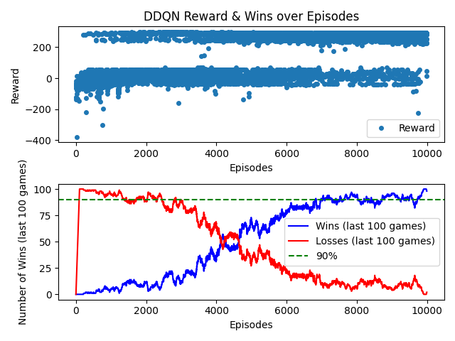

# AI Learns to Play Frogger

Hello!

This project is a simple implementation of a frogger-like game, with two AI agents that learn to play it using Deep Q-learning and NEAT.
It was developed by Liel Amar, Tomer Meidan and Omer Ferster from The Hebrew University of Jerusalem, as part of the course "Introduction to Artificial Intelligence" (2024).

## Installation
To install the required packages, use your favorite package manager to initialize a new environment.
Then, run the following command to install the required packages:
```bash
pip install -r requirements.txt
```

## Configuration
There are several configuration flags that can be inputted to the program, to change the behavior of the game and the learning algorithms.
The flags are as follows:
- `--agent`: The agent to use. Can be either `dqn`, `neat`, `random`, `onlyup` or `human`. Default is `random`.
- `--fps`: The frames per second of the game. Default is 5.
- `--grid_like`: Whether to use a grid-like environment or a continuous one. Default is `False`.
- `--train`: Whether to include the train obstacle or not. Default is `False`.
- `--neat_config`: The configuration file for NEAT. Default is `neat-config.txt`.
- `--generations`: The number of generations to run NEAT for. Default is 200.
- `--plot`: Whether to plot the results or not. Default is `False`.
- `--test`: Whether to test a model or not. Default is None. `*` tests all available models will be tested. Can also be a specific model name to be tested.
- `--multi_test`: Whether to test multiple models or not. Default is `False`.

* Note that when the game runs, you can click on "space" to change the speed of the game from 5 fps to the original fps given under the `fps` flag.

## Our Agents

During our time working on the project, we tweaked and tuned our agents to achieve the best results possible. Here are the results of our base agents and best agents:

### Random Agent

#### Information
The random agent is the first base-line agent we decided to implement. It simply chooses a random action from the available actions at each time step. The win rate of this agent is 0% even with only the cars obstacle.

#### Testing
To run this model, use the following command:

```bash
python main.py --agent=random --grid_like --fps=500 --lives=1 --games=100
```

### Only Up Agent

#### Information
The only up agent is the second base-line agent we decided to implement. It simply chooses the "up" action at each time step. The win rate of this agent is ~40% with only the cars obstacle, ~40% with cars and a train and 0% win rate with cars, train and water section.
The reason this agent has a higher win rate than the random agent is because sometimes, going just up is enough to avoid all cars. However, most times the agent will encounter obstacles, and the only-up agent, has no idea how to deal with them.

#### Testing
To run this model, use the following command:

```bash
python main.py --agent=onlyup --grid_like --fps=500 --lives=1 --games=100
```

### NEAT

#### Information
The best agent we managed to train using the NEAT algorithm achieved a win rate of 99%. It took a long time of playing with the configuration file, and the main principle that guided us was to achieve a smooth and steady convergence over time.
In this section, we'll go over the exact configuration and code that lead to us getting a 99% win rate.

#### Testing
You can test this model yourself. It is included in this project under: `models/neat/99%.pkl`.

To run this model, use the following command:

```bash
python main.py --agent=neat --grid_like --fps=500 --lives=1 --games=100 --test="99%.pkl"
```

#### Training

Let's go over the main parts of the training of this model:
1. Run command:
    ```bash
    python main.py --agent=neat --grid_like --fps=500 --lives=3 --generations=300 --plot
    ```

2. Configuration file: `neat-config.txt`: 
    ```text
    [NEAT]
    fitness_criterion     = max
    fitness_threshold     = 22.5
    pop_size              = 400
    reset_on_extinction   = False
    
    [DefaultGenome]
    # node activation options
    activation_default      = tanh
    activation_mutate_rate  = 0.3
    activation_options      = tanh relu
    
    # node aggregation options
    aggregation_default     = sum
    aggregation_mutate_rate = 0.4
    aggregation_options     = sum
    
    # node bias options
    bias_init_mean          = 0.0
    bias_init_stdev         = 1.0
    bias_max_value          = 30.0
    bias_min_value          = -30.0
    bias_mutate_power       = 0.5
    bias_mutate_rate        = 0.3
    bias_replace_rate       = 0.1
    
    # genome compatibility options
    compatibility_disjoint_coefficient = 2
    compatibility_weight_coefficient   = 0.5
    
    # connection options
    conn_add_prob           = 0.2
    conn_enable_prob        = 0.2
    conn_initial_connection = unconnected
    conn_weight_init_mean   = 0.0
    conn_weight_init_stdev  = 1.0
    conn_weight_max_value   = 30
    conn_weight_min_value   = -30
    conn_weight_mutate_power= 0.5
    conn_weight_mutate_rate = 0.4
    conn_weight_replace_rate= 0.1
    conn_delete_prob        = 0.1
    enabled_default         = True
    enabled_mutate_rate     = 0.1
    
    # weight initialization options
    weight_init_mean        = 0.0
    weight_init_stdev       = 1.0
    weight_max_value        = 30.0
    weight_min_value        = -30.0
    weight_mutate_power     = 0.4
    weight_mutate_rate      = 0.3
    weight_replace_rate     = 0.1
    
    # node response options
    response_init_mean      = 1.0
    response_init_stdev     = 0.0
    response_max_value      = 30.0
    response_min_value      = -30.0
    response_mutate_power   = 0.5
    response_mutate_rate    = 0.2
    response_replace_rate   = 0.1
    
    # genome node options
    num_hidden              = 3
    num_inputs              = 24
    num_outputs             = 4
    num_initial_nodes       = 0
    initial_connection      = unconnected
    feed_forward            = True
    
    # genome structural mutation options
    structural_mutation_surerate = 0.3
    node_add_prob          = 0.6
    node_disable_prob      = 0.0
    node_delete_prob       = 0.4
    
    # species options
    max_stagnation         = 10
    species_fitness_func   = max
    elitism                = 2
    
    [DefaultReproduction]
    elitism                = 2
    survival_threshold     = 0.1
    
    [DefaultSpeciesSet]
    compatibility_threshold = 4.5
    
    [DefaultStagnation]
    species_fitness_func = max
    max_stagnation = 20
    species_elitism = 2
    ```

3. State function (under `src/agents/neat/neat_player.py`)
    ```python
    def get_state(self, obstacles: pygame.sprite.Group = None, logs: pygame.sprite.Group = None) -> list:
        states = 25

        states += 5 if self.settings.train else 0
        states += 15 if self.settings.water else 0

        state = [0.0] * states

        # Left-Side Sensor (directly horizontal to the left)
        for obstacle in obstacles:
            if obstacle.rect.y == self.rect.y and obstacle.rect.x < self.rect.x:
                distance = (self.rect.x - obstacle.rect.x) / CELL_SIZE
                if distance <= self.MAX_DISTANCE:
                    state[0] = max(state[0], 1.0 - (distance * (1 / self.MAX_DISTANCE)))
                    state[13] = obstacle.direction.x

        # Right-Side Sensor (directly horizontal to the right)
        for obstacle in obstacles:
            if obstacle.rect.y == self.rect.y and obstacle.rect.x > self.rect.x:
                distance = (obstacle.rect.x - self.rect.x) / CELL_SIZE
                if distance <= self.MAX_DISTANCE:
                    state[1] = max(state[1], 1.0 - (distance * (1 / self.MAX_DISTANCE)))
                    state[14] = obstacle.direction.x

        # Up-Side Sensor (directly vertical above)
        for obstacle in obstacles:
            if obstacle.rect.x == self.rect.x and obstacle.rect.y < self.rect.y:
                distance = (self.rect.y - obstacle.rect.y) / CELL_SIZE
                if distance <= self.MAX_DISTANCE:
                    state[2] = max(state[2], 1.0 - (distance * (1 / self.MAX_DISTANCE)))
                    state[15] = obstacle.direction.x

        # Down-Side Sensor (directly vertical below)
        for obstacle in obstacles:
            if obstacle.rect.x == self.rect.x and obstacle.rect.y > self.rect.y:
                distance = (obstacle.rect.y - self.rect.y) / CELL_SIZE
                if distance <= self.MAX_DISTANCE:
                    state[3] = max(state[3], 1.0 - (distance * (1 / self.MAX_DISTANCE)))
                    state[16] = obstacle.direction.x

        # Top-Left Sensor (one row above, to the left)
        for obstacle in obstacles:
            if obstacle.rect.y == self.rect.y - CELL_SIZE and obstacle.rect.x < self.rect.x:
                distance = (self.rect.x - obstacle.rect.x) / CELL_SIZE
                if distance <= self.MAX_DISTANCE:
                    state[4] = max(state[4], 1.0 - (distance * (1 / self.MAX_DISTANCE)))
                    state[17] = obstacle.direction.x

        # Top-Right Sensor (one row above, to the right)
        for obstacle in obstacles:
            if obstacle.rect.y == self.rect.y - CELL_SIZE and obstacle.rect.x > self.rect.x:
                distance = (obstacle.rect.x - self.rect.x) / CELL_SIZE
                if distance <= self.MAX_DISTANCE:
                    state[5] = max(state[5], 1.0 - (distance * (1 / self.MAX_DISTANCE)))
                    state[18] = obstacle.direction.x

        # Bottom-Left Sensor (one row below, to the left)
        for obstacle in obstacles:
            if obstacle.rect.y == self.rect.y + CELL_SIZE and obstacle.rect.x < self.rect.x:
                distance = (self.rect.x - obstacle.rect.x) / CELL_SIZE
                if distance <= self.MAX_DISTANCE:
                    state[6] = max(state[6], 1.0 - (distance * (1 / self.MAX_DISTANCE)))
                    state[19] = obstacle.direction.x

        # Bottom-Right Sensor (one row below, to the right)
        for obstacle in obstacles:
            if obstacle.rect.y == self.rect.y + CELL_SIZE and obstacle.rect.x > self.rect.x:
                distance = (obstacle.rect.x - self.rect.x) / CELL_SIZE
                if distance <= self.MAX_DISTANCE:
                    state[7] = max(state[7], 1.0 - (distance * (1 / self.MAX_DISTANCE)))
                    state[20] = obstacle.direction.x

        # Top-Top-Left Sensor (two rows above, to the left)
        for obstacle in obstacles:
            if obstacle.rect.y == self.rect.y - CELL_SIZE * 2 and obstacle.rect.x < self.rect.x:
                distance = (self.rect.x - obstacle.rect.x) / CELL_SIZE
                if distance <= self.MAX_DISTANCE:
                    state[8] = max(state[8], 1.0 - (distance * (1 / self.MAX_DISTANCE)))
                    state[21] = obstacle.direction.x

        # Top-Top-Right Sensor (two rows above, to the right)
        for obstacle in obstacles:
            if obstacle.rect.y == self.rect.y - CELL_SIZE * 2 and obstacle.rect.x > self.rect.x:
                distance = (obstacle.rect.x - self.rect.x) / CELL_SIZE
                if distance <= self.MAX_DISTANCE:
                    state[9] = max(state[9], 1.0 - (distance * (1 / self.MAX_DISTANCE)))
                    state[22] = obstacle.direction.x

        # Bottom-Bottom-Left Sensor (two rows below, to the left)
        for obstacle in obstacles:
            if obstacle.rect.y == self.rect.y + CELL_SIZE * 2 and obstacle.rect.x < self.rect.x:
                distance = (self.rect.x - obstacle.rect.x) / CELL_SIZE
                if distance <= self.MAX_DISTANCE:
                    state[10] = max(state[10], 1.0 - (distance * (1 / self.MAX_DISTANCE)))
                    state[23] = obstacle.direction.x

        # Bottom-Bottom-Right Sensor (two rows below, to the right)
        for obstacle in obstacles:
            if obstacle.rect.y == self.rect.y + CELL_SIZE * 2 and obstacle.rect.x > self.rect.x:
                distance = (obstacle.rect.x - self.rect.x) / CELL_SIZE
                if distance <= self.MAX_DISTANCE:
                    state[11] = max(state[11], 1.0 - (distance * (1 / self.MAX_DISTANCE)))
                    state[24] = obstacle.direction.x

        state[12] = MAX_STEPS - self.steps

        if self.settings.water:
            # Top left
            state[25] = 1.0
            for log in logs:
                if log.rect.y == self.rect.y - CELL_SIZE and log.rect.x < self.rect.x:
                    distance = (self.rect.x - log.rect.x) / CELL_SIZE
                    if distance <= self.MAX_DISTANCE:
                        state[25] = min(state[25], (distance * (1 / self.MAX_DISTANCE)))
                        state[26] = log.direction.x

            # Top right
            state[27] = 1.0
            for log in logs:
                if log.rect.y == self.rect.y - CELL_SIZE and log.rect.x > self.rect.x:
                    distance = (log.rect.x - self.rect.x) / CELL_SIZE
                    if distance <= self.MAX_DISTANCE:
                        state[27] = min(state[27], (distance * (1 / self.MAX_DISTANCE)))
                        state[28] = log.direction.x

            # Bottom left
            state[29] = 1.0
            for log in logs:
                if log.rect.y == self.rect.y + CELL_SIZE and log.rect.x < self.rect.x:
                    distance = (self.rect.x - log.rect.x) / CELL_SIZE
                    if distance <= self.MAX_DISTANCE:
                        state[29] = min(state[29], (distance * (1 / self.MAX_DISTANCE)))
                        state[30] = log.direction.x

            # Bottom right
            state[31] = 1.0
            for log in logs:
                if log.rect.y == self.rect.y + CELL_SIZE and log.rect.x > self.rect.x:
                    distance = (log.rect.x - self.rect.x) / CELL_SIZE
                    if distance <= self.MAX_DISTANCE:
                        state[31] = min(state[31], (distance * (1 / self.MAX_DISTANCE)))
                        state[32] = log.direction.x

            # Top
            state[33] = 1.0
            for log in logs:
                if log.rect.x == self.rect.x and log.rect.y < self.rect.y:
                    distance = (self.rect.y - log.rect.y) / CELL_SIZE
                    if distance <= self.MAX_DISTANCE:
                        state[33] = min(state[33], (distance * (1 / self.MAX_DISTANCE)))
                        state[34] = log.direction.x

            # Bottom
            state[35] = 1.0
            for log in logs:
                if log.rect.x == self.rect.x and log.rect.y > self.rect.y:
                    distance = (log.rect.y - self.rect.y) / CELL_SIZE
                    if distance <= self.MAX_DISTANCE:
                        state[35] = min(state[35], (distance * (1 / self.MAX_DISTANCE)))
                        state[36] = log.direction.x

            for log in logs:
                if log.player is not None:
                    state[37] = 1
                    state[38] = (self.rect.x - log.rect.x) / CELL_SIZE
                    state[39] = ((log.rect.x + (log.rect.width - CELL_SIZE)) - self.rect.x) / CELL_SIZE

        if self.settings.train:
            for obstacle in obstacles:
                if isinstance(obstacle, Train):
                    state[40 if self.settings.water else 25] = obstacle.direction.x
                    state[41 if self.settings.water else 26] = obstacle.direction.x
                    state[42 if self.settings.water else 27] = obstacle.rect.x / CELL_SIZE

            state[43 if self.settings.water else 28] = self.rect.x
            state[44 if self.settings.water else 29] = self.rect.y

        return state
    ```

4. Fitness function (under `src/agents/neat/neat_game.py`)
    ```python
    def update_game_frame(self):
        ...
        direction = Direction.from_int(direction_index)
    
        self.update_player(player, direction)
    
        if player.won:
            player.fitnesses[player.game_id] += player.steps / 10
    
        if not player.alive:
            progress_made = ((HEIGHT - player.rect.y) // CELL_SIZE) - 1
    
            player.fitnesses[player.game_id] += progress_made
    
            if player.game_id < self.settings.lives - 1:
                ...
            else:
                unique_actions = len(set(player.action_taken))
                average_fitness = sum(player.fitnesses) / len(player.fitnesses)
    
                self.genomes[x].fitness += unique_actions + average_fitness
                ...
    ```

#### Plots


As you can see, after the ~20th generation, our model constantly gets above 20 fitness score. Getting above 15 fitness score means the model had won the game.


### DQN

#### Information
The best agent we managed to train using the DQN (Double DQN) algorithm achieved a win rate of 95%. The main principle that guided us was to balance the reward function and state representation to achieve the best results.
In this section, we'll go over the exact configuration and code that lead to us getting a 95% win rate.

It is important to note that the exact variation of the DQN algorithm we used is the Double DQN algorithm.

#### Testing
You can test this model yourself. It is included in this project under: `models/dqn/95%.pth`.

To run this model, use the following command:

```bash
python main.py --agent=dqn --grid_like --fps=500 --lives=1 --games=100 --test="95%.pth"
```

#### Training

Let's go over the main parts of the training of this model:
1. Run command:
    ```bash
    python main.py --agent=dqn --grid_like --fps=500 --lives=1 --games=2000 --plot
    ```

2. Model (under `src/agents/dqn/dqn_model.py`):
    ```python
    class DQNModel(nn.Module):
        def __init__(self, state_dim: int, action_dim: int):
            super(DQNModel, self).__init__()

            self.fc1 = nn.Linear(state_dim, 64).to(device='cuda')
            self.fc2 = nn.Linear(64, 64).to(device='cuda')
            self.fc3 = nn.Linear(64, action_dim).to(device='cuda')

        def forward(self, state):
            x = torch.relu(self.fc1(state))
            x = torch.relu(self.fc2(x))
            return self.fc3(x)
    ```

3. Agent (under `src/agents/dqn/dqn_agent.py`):
   ```python
    class DQNAgent:
       def __init__(self, settings: Namespace, state_dim: int = 25, action_dim: int = 5):
           self.settings = settings

           self.state_dim = state_dim
           self.action_dim = action_dim

           self.memory = deque(maxlen=40000)

           self.gamma = 0.99
           self.epsilon = 1.0
           self.epsilon_min = 0.01
           self.epsilon_decay = 0.999

           self.batch_size = 128
           self.learning_rate = 0.0002

           self.model = DQNModel(state_dim, action_dim)
           self.target_model = DQNModel(state_dim, action_dim)
           self.update_target_model()

           self.optimizer = optim.Adam(self.model.parameters(), lr=self.learning_rate)
           self.criterion = nn.MSELoss()

       def update_learning_rate(self):
           for param_group in self.optimizer.param_groups:
               param_group['lr'] = param_group['lr'] / 10

       def update_target_model(self):
           self.target_model.load_state_dict(self.model.state_dict())

       def remember(self, state, action, reward, next_state, done):
           self.memory.append((state, action, reward, next_state, done))

       def act(self, state) -> int:
           if self.settings.test is None:
               if random.random() <= self.epsilon:
                   return random.randint(0, self.action_dim - 1)

           state = torch.FloatTensor(state).unsqueeze(0).to(device='cuda')

           with torch.no_grad():
               q_values = self.model(state)

           return np.argmax(q_values.cpu().data.numpy())

       def replay(self):
           if len(self.memory) < self.batch_size:
               return

           minibatch = random.sample(self.memory, self.batch_size)

           states, actions, rewards, next_states, dones = zip(*minibatch)

           states = torch.FloatTensor(states).to(device='cuda')
           next_states = torch.FloatTensor(next_states).to(device='cuda')
           actions = torch.LongTensor(actions).unsqueeze(1).to(device='cuda')
           rewards = torch.FloatTensor(rewards).to(device='cuda')
           dones = torch.FloatTensor(dones).to(device='cuda')

           q_values = self.model(states).gather(1, actions).squeeze(1)

           next_actions = self.model(next_states).max(1)[1].unsqueeze(1)

           next_q_values = self.target_model(next_states).gather(1, next_actions).squeeze(1).detach()

           targets = rewards + (1 - dones) * self.gamma * next_q_values

           loss = self.criterion(q_values.squeeze(), targets)

           self.optimizer.zero_grad()
           loss.backward()
           self.optimizer.step()

           self.epsilon = max(self.epsilon_min, self.epsilon * self.epsilon_decay)
   ```

4. State function (under `src/agents/dqn/dqn_player.py`)
    ```python
    def get_state(self, obstacles: pygame.sprite.Group = None, logs: pygame.sprite.Group = None) -> list:
        states = 25

        states += 5 if self.settings.train else 0
        states += 15 if self.settings.water else 0

        state = [0.0] * states

        # Left-Side Sensor (directly horizontal to the left)
        for obstacle in obstacles:
            if obstacle.rect.y == self.rect.y and obstacle.rect.x < self.rect.x:
                distance = (self.rect.x - obstacle.rect.x) / CELL_SIZE
                if distance <= self.MAX_DISTANCE:
                    state[0] = max(state[0], 1.0 - (distance * (1 / self.MAX_DISTANCE)))
                    state[13] = obstacle.direction.x

        # Right-Side Sensor (directly horizontal to the right)
        for obstacle in obstacles:
            if obstacle.rect.y == self.rect.y and obstacle.rect.x > self.rect.x:
                distance = (obstacle.rect.x - self.rect.x) / CELL_SIZE
                if distance <= self.MAX_DISTANCE:
                    state[1] = max(state[1], 1.0 - (distance * (1 / self.MAX_DISTANCE)))
                    state[14] = obstacle.direction.x

        # Up-Side Sensor (directly vertical above)
        for obstacle in obstacles:
            if obstacle.rect.x == self.rect.x and obstacle.rect.y < self.rect.y:
                distance = (self.rect.y - obstacle.rect.y) / CELL_SIZE
                if distance <= self.MAX_DISTANCE:
                    state[2] = max(state[2], 1.0 - (distance * (1 / self.MAX_DISTANCE)))
                    state[15] = obstacle.direction.x

        # Down-Side Sensor (directly vertical below)
        for obstacle in obstacles:
            if obstacle.rect.x == self.rect.x and obstacle.rect.y > self.rect.y:
                distance = (obstacle.rect.y - self.rect.y) / CELL_SIZE
                if distance <= self.MAX_DISTANCE:
                    state[3] = max(state[3], 1.0 - (distance * (1 / self.MAX_DISTANCE)))
                    state[16] = obstacle.direction.x

        # Top-Left Sensor (one row above, to the left)
        for obstacle in obstacles:
            if obstacle.rect.y == self.rect.y - CELL_SIZE and obstacle.rect.x < self.rect.x:
                distance = (self.rect.x - obstacle.rect.x) / CELL_SIZE
                if distance <= self.MAX_DISTANCE:
                    state[4] = max(state[4], 1.0 - (distance * (1 / self.MAX_DISTANCE)))
                    state[17] = obstacle.direction.x

        # Top-Right Sensor (one row above, to the right)
        for obstacle in obstacles:
            if obstacle.rect.y == self.rect.y - CELL_SIZE and obstacle.rect.x > self.rect.x:
                distance = (obstacle.rect.x - self.rect.x) / CELL_SIZE
                if distance <= self.MAX_DISTANCE:
                    state[5] = max(state[5], 1.0 - (distance * (1 / self.MAX_DISTANCE)))
                    state[18] = obstacle.direction.x

        # Bottom-Left Sensor (one row below, to the left)
        for obstacle in obstacles:
            if obstacle.rect.y == self.rect.y + CELL_SIZE and obstacle.rect.x < self.rect.x:
                distance = (self.rect.x - obstacle.rect.x) / CELL_SIZE
                if distance <= self.MAX_DISTANCE:
                    state[6] = max(state[6], 1.0 - (distance * (1 / self.MAX_DISTANCE)))
                    state[19] = obstacle.direction.x

        # Bottom-Right Sensor (one row below, to the right)
        for obstacle in obstacles:
            if obstacle.rect.y == self.rect.y + CELL_SIZE and obstacle.rect.x > self.rect.x:
                distance = (obstacle.rect.x - self.rect.x) / CELL_SIZE
                if distance <= self.MAX_DISTANCE:
                    state[7] = max(state[7], 1.0 - (distance * (1 / self.MAX_DISTANCE)))
                    state[20] = obstacle.direction.x

        # Top-Top-Left Sensor (two rows above, to the left)
        for obstacle in obstacles:
            if obstacle.rect.y == self.rect.y - CELL_SIZE * 2 and obstacle.rect.x < self.rect.x:
                distance = (self.rect.x - obstacle.rect.x) / CELL_SIZE
                if distance <= self.MAX_DISTANCE:
                    state[8] = max(state[8], 1.0 - (distance * (1 / self.MAX_DISTANCE)))
                    state[21] = obstacle.direction.x

        # Top-Top-Right Sensor (two rows above, to the right)
        for obstacle in obstacles:
            if obstacle.rect.y == self.rect.y - CELL_SIZE * 2 and obstacle.rect.x > self.rect.x:
                distance = (obstacle.rect.x - self.rect.x) / CELL_SIZE
                if distance <= self.MAX_DISTANCE:
                    state[9] = max(state[9], 1.0 - (distance * (1 / self.MAX_DISTANCE)))
                    state[22] = obstacle.direction.x

        # Bottom-Bottom-Left Sensor (two rows below, to the left)
        for obstacle in obstacles:
            if obstacle.rect.y == self.rect.y + CELL_SIZE * 2 and obstacle.rect.x < self.rect.x:
                distance = (self.rect.x - obstacle.rect.x) / CELL_SIZE
                if distance <= self.MAX_DISTANCE:
                    state[10] = max(state[10], 1.0 - (distance * (1 / self.MAX_DISTANCE)))
                    state[23] = obstacle.direction.x

        # Bottom-Bottom-Right Sensor (two rows below, to the right)
        for obstacle in obstacles:
            if obstacle.rect.y == self.rect.y + CELL_SIZE * 2 and obstacle.rect.x > self.rect.x:
                distance = (obstacle.rect.x - self.rect.x) / CELL_SIZE
                if distance <= self.MAX_DISTANCE:
                    state[11] = max(state[11], 1.0 - (distance * (1 / self.MAX_DISTANCE)))
                    state[24] = obstacle.direction.x

        state[12] = MAX_STEPS - self.steps

        if self.settings.water:
            # Top left
            state[25] = 1.0
            for log in logs:
                if log.rect.y == self.rect.y - CELL_SIZE and log.rect.x < self.rect.x:
                    distance = (self.rect.x - log.rect.x) / CELL_SIZE
                    if distance <= self.MAX_DISTANCE:
                        state[25] = min(state[25], (distance * (1 / self.MAX_DISTANCE)))
                        state[26] = log.direction.x

            # Top right
            state[27] = 1.0
            for log in logs:
                if log.rect.y == self.rect.y - CELL_SIZE and log.rect.x > self.rect.x:
                    distance = (log.rect.x - self.rect.x) / CELL_SIZE
                    if distance <= self.MAX_DISTANCE:
                        state[27] = min(state[27], (distance * (1 / self.MAX_DISTANCE)))
                        state[28] = log.direction.x

            # Bottom left
            state[29] = 1.0
            for log in logs:
                if log.rect.y == self.rect.y + CELL_SIZE and log.rect.x < self.rect.x:
                    distance = (self.rect.x - log.rect.x) / CELL_SIZE
                    if distance <= self.MAX_DISTANCE:
                        state[29] = min(state[29], (distance * (1 / self.MAX_DISTANCE)))
                        state[30] = log.direction.x

            # Bottom right
            state[31] = 1.0
            for log in logs:
                if log.rect.y == self.rect.y + CELL_SIZE and log.rect.x > self.rect.x:
                    distance = (log.rect.x - self.rect.x) / CELL_SIZE
                    if distance <= self.MAX_DISTANCE:
                        state[31] = min(state[31], (distance * (1 / self.MAX_DISTANCE)))
                        state[32] = log.direction.x

            # Top
            state[33] = 1.0
            for log in logs:
                if log.rect.x == self.rect.x and log.rect.y < self.rect.y:
                    distance = (self.rect.y - log.rect.y) / CELL_SIZE
                    if distance <= self.MAX_DISTANCE:
                        state[33] = min(state[33], (distance * (1 / self.MAX_DISTANCE)))
                        state[34] = log.direction.x

            # Bottom
            state[35] = 1.0
            for log in logs:
                if log.rect.x == self.rect.x and log.rect.y > self.rect.y:
                    distance = (log.rect.y - self.rect.y) / CELL_SIZE
                    if distance <= self.MAX_DISTANCE:
                        state[35] = min(state[35], (distance * (1 / self.MAX_DISTANCE)))
                        state[36] = log.direction.x

            for log in logs:
                if log.player is not None:
                    state[37] = 1
                    state[38] = (self.rect.x - log.rect.x) / CELL_SIZE
                    state[39] = ((log.rect.x + (log.rect.width - CELL_SIZE)) - self.rect.x) / CELL_SIZE

        if self.settings.train:
            for obstacle in obstacles:
                if isinstance(obstacle, Train):
                    state[40 if self.settings.water else 25] = obstacle.direction.x
                    state[41 if self.settings.water else 26] = obstacle.direction.x
                    state[42 if self.settings.water else 27] = obstacle.rect.x / CELL_SIZE

            state[43 if self.settings.water else 28] = self.rect.x
            state[44 if self.settings.water else 29] = self.rect.y

        return state
    ```

5. Reward function (under `src/agents/dqn/dqn_game.py`)
    ```python
    def update_game_frame(self):
        super().update_game_frame()

        self.reward = 0

        ...
   
        direction = Direction.from_int(output)

        self.update_player(player, direction)

        if player.won:
            self.reward += 100 + player.steps * 2

        progress_made = ((HEIGHT - player.rect.y) // CELL_SIZE) - 1

        if direction == Direction.UP:
            self.reward += 1
        if direction == Direction.DOWN:
            self.reward -= 1

        if self.settings.train:
            if player.rect.x // CELL_SIZE < 3 or player.rect.x // CELL_SIZE > 13:
                self.reward -= min(abs(player.rect.x // CELL_SIZE - 8), abs(player.rect.x // CELL_SIZE - 9))

        if direction == Direction.UP and player.best_progress < progress_made:
            self.reward += progress_made
            player.best_progress = progress_made

        if not player.alive:
            if not player.won:
                self.reward -= 50

            if player.game_id < self.settings.lives - 1:
                ...
    ```

#### Plots


As you can see, after ~1500 episodes, our model starts constantly improving and winning more than losing. At the peak, it achieves more than 90%.


### DQN (with trains)

#### Information
We wanted to give the DQN agent a harder challenge, and so we added an obstacle of a train moving horizontally.
The chance of a train to spawn (in case there isn't an active train already) is 5%, and the agent got a win rate of 91% in this environment, after training for 5000

#### Testing
You can test this model yourself. It is included in this project under: `models/dqn/91% with train.pth`.

To run this model, use the following command:

```bash
python main.py --agent=dqn --grid_like --fps=500 --lives=1 --games=100 --test="91% with train.pth" --train
```

#### Training

Let's go over the main parts of the training of this model:
1. Run command:
    ```bash
    python main.py --agent=dqn --grid_like --fps=500 --lives=1 --games=5000 --plot --train
    ```

2. As for the Model, Agent, State function and Reward function, they are exactly the same, except now `settings.train` is `True`, which adds 5 new sensors to the state, and a new penalty for getting to close to the sides of the screen.

#### Plots


As you can see, after ~1000 episodes, our model starts constantly improving and winning more than losing. At the peak, it achieves about 90%.


### DQN (with water and trains)

#### Information
We wanted to give the DQN agent an even harder challenge, and so we added an obstacle of a train moving horizontally, and a water obstacle with logs moving vertically.
The chance of a train to spawn (in case there isn't an active train already) is 5%, and the logs move at a speed of 1 cell per frame. The player must jump on the logs to cross the water.
The agent got a win rate of 99% in this environment, after training it for 10,000 episodes.

#### Testing
You can test this model yourself. It is included in this project under: `models/dqn/99% with water and train.pth`.

To run this model, use the following command:

```bash
python main.py --agent=dqn --grid_like --fps=500 --lives=1 --games=100 --test="99% water train.pth" --water --train
```

#### Training

Let's go over the main parts of the training of this model:
1. Run command:
    ```bash
    python main.py --agent=dqn --grid_like --fps=500 --lives=1 --games=10000 --plot --train --water
    ```

2. As for the Model, Agent, State function and Reward function, they are exactly the same, except now `settings.train` and `settings.water` are `True`, which adds 5 new sensors for the train, a new penalty for getting to close to the sides of the screen, and 12 new sensors for the water.

#### Plots


### Gallery
